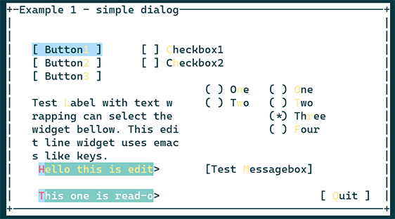

# JTTUI
## Text User Interface (TUI) widget library for  Ruby

JTTui is a text-mode user interface toolkit for ruby that uses curses. 

### Rquirements

JTTUI depens on ruby and ncurses libraries.

* Fedora/CentOS
```
$ sudo dnf install ruby-devel
$ sudo dnf install ncurses-devel
```
* Ubuntu

```
$ sudo apt install ruby-dev
$ sudo apt install ncurses-dev
```
### Install
```
$ ruby extconf.rb
$ make
$ sudo make install
```
### How to use
Sample scripts under `examples/` are good starting point.
* example-jttuistd-1-simple.rb


* example-jttuistd-2-calculator.rb


### Code structure
Please refer [JTTUI starting guide](./doc/Documentation/starting-guide.txt).

### Limitations
* Only ASCII charactors can be properly handled. 
  Multibyte charactors does not work.
* Changing terminal window size will cause program abort.
### License
This program is protected by copyright.
See more in [doc/LICENSE](./doc/LICENSE) file.
<br>Also see doc/ directory to read documentation.

All programs are copyrighted by Jakub Travnik.
<br>Porting to ruby-2.7.2/3.0.1 environment is done by
Donarno Dan Baker who is the owner of this github repository.

